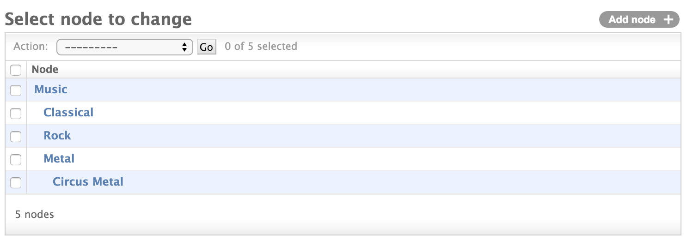
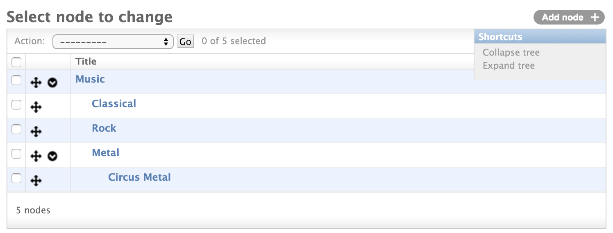
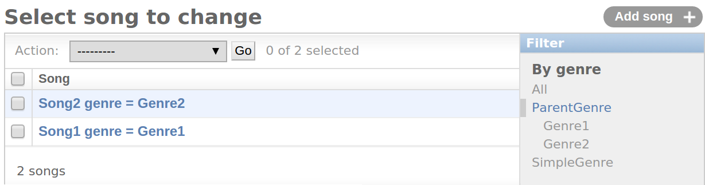

=============
Admin classes
=============

``mptt.admin.MPTTModelAdmin``
~~~~~~~~~~~~~~~~~~~~~~~~~~~~~

This is a bare-bones tree admin. All it does is enforce ordering, and indent the nodes
in the tree to make a pretty tree list view.

Usage::

    from django.contrib import admin
    from mptt.admin import MPTTModelAdmin
    from myproject.myapp.models import Node

    admin.site.register(Node, MPTTModelAdmin)

You can change the indent pixels per level globally by putting this in your
settings.py::

    # default is 10 pixels
    MPTT_ADMIN_LEVEL_INDENT = 20

If you'd like to specify the pixel amount per Model, define an ``mptt_level_indent``
attribute in your MPTTModelAdmin::

    from django.contrib import admin
    from mptt.admin import MPTTModelAdmin
    from myproject.myapp.models import Node

    class CustomMPTTModelAdmin(MPTTModelAdmin):
        # specify pixel amount for this ModelAdmin only:
        mptt_level_indent = 20

    admin.site.register(Node, CustomMPTTModelAdmin)

If you'd like to specify which field should be indented, add an ``mptt_indent_field``
to your MPTTModelAdmin::

    # …
    class CustomMPTTModelAdmin(MPTTModelAdmin):
        mptt_indent_field = "some_node_field"
    # …

``mptt.admin.DraggableMPTTAdmin``
~~~~~~~~~~~~~~~~~~~~~~~~~~~~~~~~~

.. versionadded:: 0.8.1

This is a tree admin based on FeinCMS_ offering drag-drop functionality for
moving nodes::

    from django.contrib import admin
    from mptt.admin import DraggableMPTTAdmin
    from myproject.myapp.models import Node

    admin.site.register(
        Node,
        DraggableMPTTAdmin,
        list_display=(
            'tree_actions',
            'indented_title',
            # ...more fields if you feel like it...
        ),
        list_display_links=(
            'indented_title',
        ),
    )

.. note::

   Supported browsers include all recent versions of Firefox, Chrome,
   Safari and Internet Explorer (9 or better).

.. warning::

   Does not work well with big trees (more than a few hundred nodes, or trees
   deeper than 10 levels). Patches implementing lazy-loading of deep trees
   are very much appreciated.

It is recommended that ``tree_actions`` is the first value passed to
``list_display``; this also requires you to specify ``list_display_links``
because ``tree_actions`` cannot be used as the object link field.

``indented_title`` does nothing but return the indented self-description
of nodes, ``20px`` per level (or the value of ``mptt_level_indent``,
see below.)

``list_per_page`` is set to 2000 by default (which effectively disables
pagination for most trees).

You may set the attribute ``expand_tree_by_default = True`` in your
DraggableMPTTAdmin to expand the tree on first page visit (default is
False). After this the state of every node (expanded or collapsed) is saved
to the browser storage.

Replacing ``indented_title``
----------------------------

If you want to replace the ``indented_title`` method with your own, we
recommend using the following code::

    from django.utils.html import format_html

    class MyDraggableMPTTAdmin(DraggableMPTTAdmin):
        list_display = ('tree_actions', 'something')
        list_display_links = ('something',)

        def something(self, instance):
            return format_html(
                '
{}
',
                instance._mpttfield('level') * self.mptt_level_indent,
                instance.name,  # Or whatever you want to put here
            )
        something.short_description = _('something nice')

For changing the indentation per node, look below. Simply replacing
``indented_title`` is insufficient because the indentation also needs
to be communicated to the JavaScript code.

Overriding admin templates per app or model
-------------------------------------------

``DraggableMPTTAdmin`` uses the stock admin changelist template with some CSS
and JavaScript on top, so simply follow the official guide for
`overriding admin templates`_.

Changing the indentation of nodes
---------------------------------

Simply set ``mptt_level_indent`` to a different pixel value (defaults
to ``20``)::

    # ...
    class MyDraggableMPTTAdmin(DraggableMPTTAdmin):
        mptt_level_indent = 50
    # ...

.. _overriding admin templates: https://docs.djangoproject.com/en/2.0/ref/contrib/admin/#overriding-admin-templates
.. _FeinCMS: https://github.com/feincms/feincms/

``mptt.admin.TreeRelatedFieldListFilter``
~~~~~~~~~~~~~~~~~~~~~~~~~~~~~~~~~~~~~~~~~

Admin filter class which filters models related to parent model with all it's descendants.

Usage::

    from mptt.admin import TreeRelatedFieldListFilter

    @admin.register(models.MyModel)
    class MyModelAdmin(admin.ModelAdmin):
        model = models.MyModel
        list_filter =
        (
            ('my_related_model', TreeRelatedFieldListFilter),
        )

Changing the indentation of list filter nodes
---------------------------------------------

Simply set ``mptt_level_indent`` to a different pixel value (defaults
to ``10``)::

    # ...
    class MyTreeRelatedFieldListFilter(TreeRelatedFieldListFilter):
    mptt_level_indent = 20
    # ...
